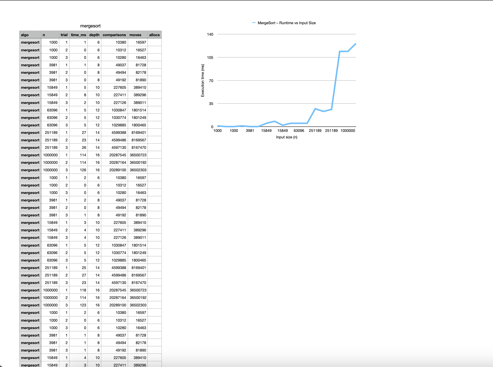
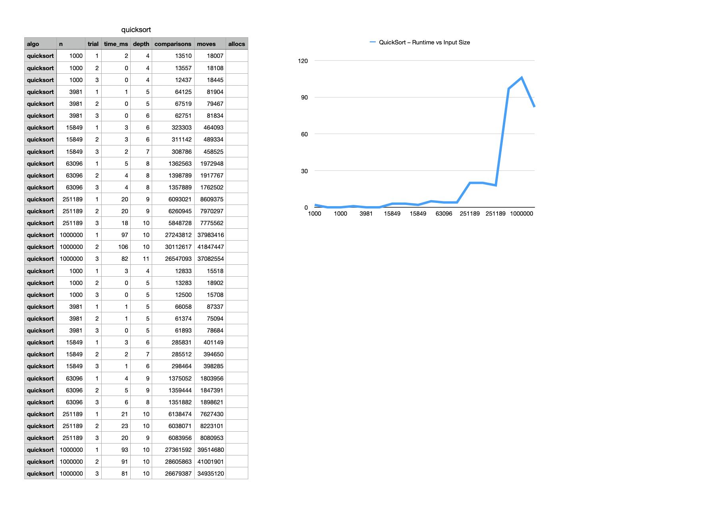
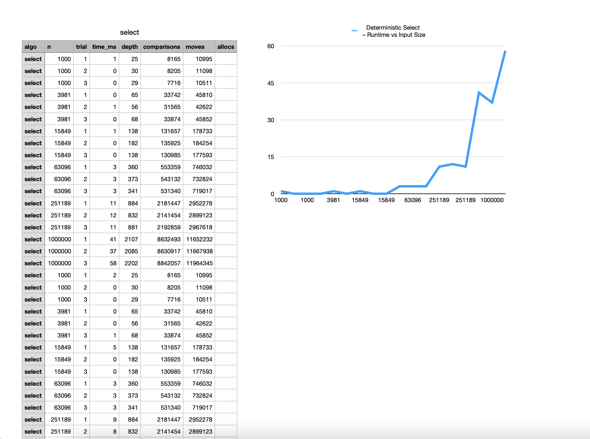
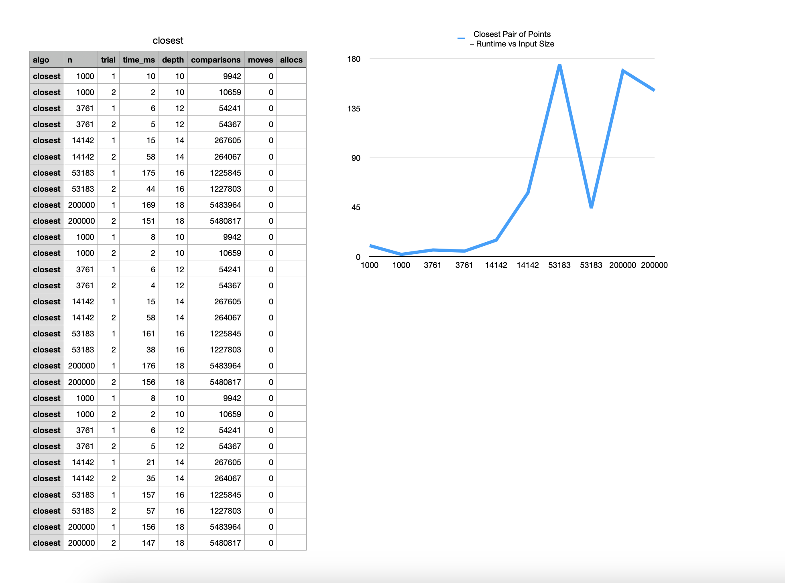

# Assignment 1 - Design and Analysis of Algorithms

This is my first assignment for the Design and Analysis of Algorithms course.  
The task was to implement a few classic algorithms, test them, and also check how they behave on different input sizes.

---

## Implemented algorithms

I wrote four algorithms:

- MergeSort (with small-n cut-off to insertion sort)  
- QuickSort (randomized pivot and recursion into the smaller part first)  
- Deterministic Select (median-of-medians, groups of 5)  
- Closest Pair of Points in 2D (divide-and-conquer version)

All code is in Java. For testing I used JUnit5.

---

## How the project is organized

- `algo/` - implementations of algorithms  
- `util/` - helper class `Metrics` that counts comparisons, depth, moves, etc.  
- `cli/` - a simple Benchmark runner that saves results into CSV  
- `test/` - JUnit tests for every algorithm  

There is also a `metrics/` folder (local only) where the benchmark results are stored.

---

## How to run it

I worked in IntelliJ IDEA, so the easiest way is just to open the project there.  
Tests can be launched from the `test` folder.  
Benchmarks can be run using run configurations (for mergesort, quicksort, select, closest). Each of them produces a CSV file with results.

---

## What metrics I collected

For every run the program writes:
- input size `n`
- time in milliseconds
- recursion depth
- number of comparisons
- number of moves
- allocations

---

## Results in short

After running the benchmarks and making graphs (I did them in Numbers on Mac):

- MergeSort and QuickSort both grow as *n log n*, but QuickSort was usually faster on smaller arrays.  
- Select is linear and stable (works in O(n)).  
- Closest Pair is heavier, but still much better than O(n^2).  

Here is one of the graphs I got (time vs input size):

### MergeSort

### QuickSort

### Deterministic Select

### Closest Pair of Points

## Summary

In this assignment I implemented four algorithms: MergeSort, QuickSort, Deterministic Select and Closest Pair of Points.  
I tested them for correctness and collected metrics like runtime, recursion depth and number of comparisons.  

